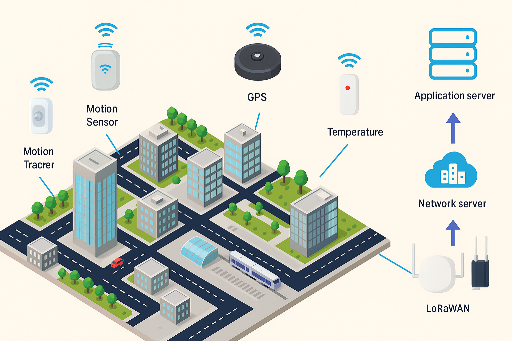
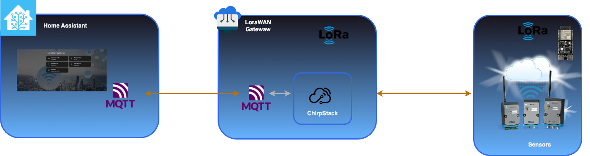

# 🌦️ Solar Powered LoRaWAN Weather Station

[](https://www.arduino.cc/)
[](https://www.chirpstack.io/)
[](https://www.home-assistant.io/)
[](LICENSE)


A comprehensive solar-powered LoRaWAN weather station built with ESP32, featuring comprehensive sensor monitoring, intelligent battery management, and seamless Home Assistant integration.

I'm starting with a brief introduction to the LoRa network, but as a reminder, LoRa allows you to connect remote sensors beyond the range of your home automation box. For example, you could connect a weather station in your country house, a mailbox or a gate at the far end of your large property, or a temperature sensor in a shed at the back of the garden...

---
## 📘 Introduction

### 🌀 Origin of LoRa

For a little anecdote, LoRa technology was developed by a Grenoble-based startup in 2009 (Cycléo). It was later acquired by the American company [Semtech](https://www.semtech.com/), which then gained the ability to produce all the chips for this new radio system. Today, all devices implementing LoRa have a Semtech chip at their core. The protocol itself is now managed by the [LoRa Alliance foundation](https://lora-alliance.org/).

What was Cycléo's goal in developing this technology? To enable connected objects, typically sensors, to transmit their measurement readings remotely, even over long distances, while operating on battery power or with very limited energy sources (solar, battery, etc.).

### 📶 Frequencies Used

LoRa operates within license-free frequency bands, which vary depending on the region:

    863-870 MHz for Europe
    902-928 MHz for the United States, Canada, and South America
    470-510 MHz in China
    915-928 MHz for Australia
    920-923 MHz in Asia, with specific bands for each country

> ⚠️ Frequency verification is a very important point when purchasing LoRa equipment; otherwise, you may end up with unusable hardware!

### 📊 Transmitted Data

To enable very long-range transmission, the data transfer speed is very low, and the packets sent are quite small (this is completely different from Wi-Fi, which operates in full duplex mode with continuous data traffic).

It should also be noted that the packets are encrypted, so even if they can be intercepted by third parties, they cannot be decoded or exploited by them.

Thus, we have an ecosystem where sensors can run on a simple battery for several years and transmit their data over several kilometers. Even the most rugged devices easily transmit at least a few kilometers, and gateways typically have coverage of 20 to 30 km.

### 🌐  Network Choice

But first, we need to choose a network to connect our devices.
You have the option to create your own private local network using your own gateway, which will be the case in this configuration. Commercial networks will not be considered here, as their access conditions reserve them for professionals. We will focus on shared networks.

Shared networks are not very numerous, and I will mention the three most well-known and important ones. There are others, but they are very limited, whereas the three listed below now have almost worldwide coverage.

- [**Helium (Helium & LoRaWAN)**:](https://www.helium.com/lorawan) a relatively recent American network on the market, which also hosts a blockchain.
- [**The Things Network (TTN)**](https://www.thethingsnetwork.org/): a Dutch network that has been around for about ten years now. TTN is the community network provided by The Things Industries, the parent company, which offers commercial services to businesses regarding LoRa.
- [**Loriot:**](https://loriot.io/) a Swiss network that, similarly to TTN, offers a community service (limited to 30 devices per account) and a professional service with dedicated server(s).

> As mentioned previously, we will use our own LoRa network with a local Gateway.
I have finished this brief introduction. Let's begin.
 
---

## 📋 Prerequisites

- Arduino IDE
- Arduino Libraries: [DFRobot_LWNode Library](https://github.com/cdjq/DFRobot_LWNode) and MAX1704X and refer to the guide: [How to Install a Library?](https://www.arduino.cc/en/guide/libraries)
- LoRaWAN Gateway
- Home Assistant instance
- A wifi smart switch (MyStrom - Shelly ...)
---

## ✨ Features

- **🌡️ Environmental Monitoring**: Temperature, humidity, atmospheric pressure, and altitude
- **🔋 Smart Battery Management**: MAX17043 fuel gauge with voltage-based fallback estimation
- **☀️ Solar Power Integration**: DFRobot Solar Power Manager with automated charging
- **📡 LoRaWAN Connectivity**: ChirpStack v4 compatible with OTAA authentication
- **💤 Ultra-Low Power**: Deep sleep optimization with session persistence
- **🏠 Home Assistant Ready**: Complete MQTT integration with device discovery
- **🔧 Self-Diagnostic**: Comprehensive sensor validation and error reporting
- **📊 Real-time Monitoring**: Web dashboard with automated charging control

## 🛠️ Hardware Components

### Core Components
| Component | Model | Purpose | Connection |
|-----------|-------|---------|------------|
| **Microcontroller** | [DFR1054 ESP32-C6](https://www.dfrobot.com/product-2692.html) | Main processing unit | - |
| **LoRa Module** | [DFRobot DFR1115](https://www.dfrobot.com/product-2926.html) | LoRaWAN communication | SPI (GPIO 25, 26, 27) |
| **Environmental Sensor** | [M5Stack ENV Unit](https://docs.m5stack.com/en/unit/envIII) | Temperature, humidity, pressure | I2C (GPIO 21, 22) |
| **Battery Monitor** | [DFRobot DFR0563 (MAX17043)](https://www.dfrobot.com/product-1734.html) | Fuel gauge and voltage monitoring | I2C (0x36) |
| **Solar Manager** | [DFRobot DFR0559](https://www.dfrobot.com/product-1712.html) | Solar charging and power management | Analog input |
| **Analog Voltage Divider** | [DFRobot DFR0051](https://www.dfrobot.com/product-90.html) | Analog Voltage Divider  | Analog input |


### Environmental Sensors (M5Stack ENV Unit)
- **SHT30**: Temperature (-40°C to +125°C) and Humidity (0-100% RH)
- **QMP6988**: Atmospheric pressure (300-1100 hPa) and altitude calculation

### Power System
- **18650 LiPo Battery**: 3.7V primary power source
- **Solar Panel**: 6V input via DFR0559 charging controller
- **MAX17043**: Intelligent battery monitoring with calibration
- **Automated Charging**: Mystrom smart switch integration

## 🏗️ System Architecture




## 📊 Sensor Reading Process

### 1. **Wake-up Sequence**
```cpp
ESP32 Deep Sleep → RTC Timer Wake → Session Restore → Sensor Init
```

### 2. **Environmental Data Collection**
- **SHT30 Reading**: Temperature (±0.3°C) and Humidity (±2% RH)
- **QMP6988 Reading**: Pressure (±0.5 hPa) and calculated altitude
- **Data Validation**: Range checking and error detection
- **Weather State**: Automatic classification (Sunny, Cloudy, Rainy, Stormy)

### 3. **Battery Monitoring**
- **MAX17043 Query**: Voltage and state-of-charge percentage
- **Calibration Check**: Reset and QuickStart if needed
- **Fallback Estimation**: Voltage-based calculation if sensor fails
- **Solar Input**: ADC reading of charging voltage

### 4. **Data Processing**
```cpp
// 12-byte Extended Payload Format
[Temperature] [Humidity] [Pressure] [Battery%] [Weather] [Altitude] [Voltage]
    2 bytes     2 bytes    2 bytes    1 byte    1 byte    2 bytes   2 bytes
```

### 5. **LoRaWAN Transmission**
- **Session Management**: Persistent OTAA with RTC storage
- **Adaptive Data Rate**: Automatic SF optimization
- **Retry Logic**: Fallback transmission handling
- **Deep Sleep**: Immediate sleep after TX_COMPLETE

---


## 📡 LoRaWAN Gateway Configuration

### ChirpStack v4 Setup

#### 1. **Device Profile Configuration**
```json
{
  "name": "Weather_Station_Profile",
  "region": "EU868", 
  "macVersion": "1.0.3",
  "regParamsRevision": "A",
  "supportsOtaa": true,
  "supportsClassB": false,
  "supportsClassC": false,
  "maxEirp": 16,
  "payloadCodec": "CUSTOM_JS",
  "payloadEncoderScript": "",
  "payloadDecoderScript": "// See chirpstack_decoder_v4_simple.js"
}
```

#### 2. **Application Configuration**
```json
{
  "name": "Solar_Weather_Station",
  "description": "ESP32 LoRaWAN Weather Station with Solar Power",
  "integrations": [
    {
      "kind": "MQTT",
      "configuration": {
        "server": "tcp://localhost:1883",
        "username": "chirpstack",
        "password": "your_password",  
        "topicPrefix": "application/{{application_id}}/device/{{dev_eui}}/event/{{event}}",
        "retain": true,
        "qos": 1
      }
    }
  ]
}
```

#### 3. **Device Registration**
```bash
# Device EUI (LSB format)
DEVEUI: "X-X-X"

# Application Key (MSB format) 
APPKEY: "X-X-X-X-X"

# Join Server: Built-in
# Device Profile: Weather_Station_Profile
```

## 🔗 MQTT Integration

### ChirpStack to Home Assistant Bridge

#### 1. **MQTT Broker Configuration**
```yaml
# mosquitto.conf
listener 1883
allow_anonymous false
password_file /etc/mosquitto/passwd

# Bridge configuration for Home Assistant
connection bridge-ha
address homeassistant.local:1883
topic application/+/device/+/event/up out 0 "" "homeassistant/sensor/"
username ha_bridge
password your_bridge_password
try_private false
```

#### 2. **ChirpStack MQTT Settings**
- **Topic Template**: `application/{{application_id}}/device/{{dev_eui}}/event/{{event}}`
- **Retain Messages**: `true` (Critical for deep sleep compatibility)
- **QoS Level**: `1` (Ensures delivery)
- **JSON Payload**: Decoded sensor data

#### 3. **Data Flow**
```
ChirpStack → Local MQTT → Bridge → Home Assistant MQTT → Sensors
```

### MQTT Message Format
```json
{
  "applicationID": "1",
  "applicationName": "Solar_Weather_Station", 
  "deviceName": "ESP32_Weather_01",
  "devEUI": "6745230189abcdef",
  "data": {
    "temperature": 22.5,
    "humidity": 65.2,
    "pressure": 1013.8,
    "altitude": 245,
    "battery_percent": 87,
    "battery_voltage": 4.02,
    "solar_voltage": 5.8,
    "weather_state": "Partly cloudy"
  },
  "fCnt": 1245,
  "fPort": 1
}
```

---

## 🚀 Installation

### Hardware Assembly
1. **Connect M5Stack ENV** to ESP32 I2C (GPIO 21/22)
2. **Wire MAX17043** to I2C bus (address 0x36)
3. **Connect LoRa DFR1115** via SPI (GPIO 25/26/27)
4. **Install Solar Manager** with 18650 battery
5. **Mount in weatherproof enclosure**
   


### Software Configuration
1. **Clone Repository**
```bash
git clone https://github.com/colussim/lora-weather-node.git
cd lora-weather-node
```


2. **Configure Credentials**
```cpp
// Update in main .ino file
static const u1_t PROGMEM DEVEUI[8] = { YOUR_DEVEUI };
static const u1_t PROGMEM APPKEY[16] = { YOUR_APPKEY };
```

3. **Upload Firmware**
```bash
# Open Loraesp32_m5stack.ino in Arduino IDE
# Select: ESP32 Dev Module
# Upload Speed: 921600
# Flash Mode: QIO
```

## ⚙️ Configuration

### Sleep Interval
```cpp
#define SLEEP_INTERVAL 600  // 10 minutes (adjustable)
```

### Battery Thresholds
```cpp
// Low battery alert
FuelGauge.setThreshold(10);  // 10% alert threshold

// Solar charging automation
if (battery_percent < 20) {
    // Trigger Mystrom charging switch
}
```

### Sensor Calibration
```cpp
// Sea level pressure calibration
#define SEA_LEVEL_PRESSURE 1013.25

// Temperature offset (if needed)
temperature += TEMP_OFFSET;
```

## 📱 Usage

### Serial Monitor Output
```
🚀 Boot #1
🔋 Initializing MAX17043...
✅ MAX17043 initialized with calibration
🌡️ Initializing M5Stack ENV Unit...
✅ M5Stack ENV initialized

📊 EXTENDED SENSOR DATA:
  Temperature: 22.3°C
  Humidity: 64.7%
  Pressure: 1013.2 hPa
  Altitude: 247 m
  Battery: 87% (3.805V)
  Solar: 5.8V

📡 Sending LoRaWAN data...
✅ Extended data transmission completed
😴 Going to sleep...
```

### LED Status Indicators
- **Blue Flash**: LoRaWAN joining
- **Green Flash**: Successful transmission
- **Red Flash**: Sensor error
- **Off**: Deep sleep mode

---
  

## 🏠 Home Assistant Integration

### 📡 MQTT Sensor Configuration

First, configure the MQTT sensors to receive data from ChirpStack. Add this configuration to your `configuration.yaml`:

```yaml
mqtt:
  sensor:
    - name: "Outdoor Temperature LoRa"
      state_topic: "application/654057e9-61c8-42f4-a53b-1d7db288fd60/device/84be8b002054f91f/event/up"
      unit_of_measurement: "°C"
      device_class: "temperature"
      value_template: "{{ value_json.object.temperature | default(value_json.data.temperature) }}"
      icon: "mdi:thermometer"
      unique_id: "0x200967_temperature_outdoor_lora_esp32_1"

    - name: "Outdoor Humidity LoRa"
      state_topic: "application/654057e9-61c8-42f4-a53b-1d7db288fd60/device/84be8b002054f91f/event/up"
      unit_of_measurement: "%"
      device_class: "humidity"
      value_template: "{{ value_json.object.humidity | default(value_json.data.humidity) }}"
      icon: "mdi:water-percent"
      unique_id: "0x200967_humidity_outdoor_lora_esp32_1"

    - name: "Battery Percentage LoRa"
      state_topic: "application/654057e9-61c8-42f4-a53b-1d7db288fd60/device/84be8b002054f91f/event/up"
      unit_of_measurement: "%"
      device_class: "battery"
      value_template: "{{ value_json.object.battery_percent | default(value_json.data.battery_percent)}}"
      icon: "mdi:battery"
      unique_id: "0x200967_battery_percentage_outdoor_lora_esp32_1"

    - name: "Solar Panel Voltage LoRa"
      state_topic: "application/654057e9-61c8-42f4-a53b-1d7db288fd60/device/84be8b002054f91f/event/up"
      unit_of_measurement: "V"
      device_class: "voltage"
      value_template: "{{ value_json.object.solar_voltage}}"
      icon: "mdi:solar-power"
      unique_id: "0x200967_solar_panel_voltage_lora_esp32_1"

    - name: "Atmospheric Pressure LoRa"
      state_topic: "application/654057e9-61c8-42f4-a53b-1d7db288fd60/device/84be8b002054f91f/event/up"
      unit_of_measurement: "hPa"
      device_class: "pressure"
      value_template: "{{ value_json.object.pressure}}"
      icon: "mdi:gauge"
      unique_id: "0x200967_pressure_lora_esp32_1"

    - name: "Altitude LoRa"
      state_topic: "application/654057e9-61c8-42f4-a53b-1d7db288fd60/device/84be8b002054f91f/event/up"
      unit_of_measurement: "m"
      value_template: "{{ value_json.object.altitude}}"
      icon: "mdi:altimeter"
      unique_id: "0x200967_altitude_lora_esp32_1"
```

### 🔋 Input Numbers for Battery Management

Configure input numbers for battery capacity and charging current:

```yaml
input_number:
  solar_station_battery_capacity_mah:
    name: Solar Station - Battery Capacity
    min: 500
    max: 20000
    step: 50
    unit_of_measurement: "mAh"
    icon: mdi:battery
    initial: 2000

  solar_station_charging_current_ma:
    name: Solar Station - Charging Current
    min: 50
    max: 2000
    step: 50
    unit_of_measurement: "mA"
    icon: mdi:current-dc
    # Default USB power ≈ 900 mA
    initial: 900
```

### ⚡ Binary Sensors for Power Management

Create binary sensors to detect solar presence and night time:

```yaml
binary_sensor:
  - platform: template
    sensors:
      solar_station_pv_presence:
        friendly_name: "Solar Station - PV Presence"
        value_template: >-
          
          
          
          
          
            {{ v >= off_th }}
          
            {{ v >= on_th }}
          
        icon_template: >-
          
            mdi:white-balance-sunny
          
            mdi:weather-night
          
        availability_template: "{{ states('sensor.solar_panel_voltage_lora') not in ['unknown','unavailable'] }}"

  - platform: template
    sensors:
      solar_station_night:
        friendly_name: "Solar Station - Night"
        value_template: >-
          
          {{ elev < -4 }}
        icon_template: mdi:weather-night
```

### 🧠 Template Sensors for Advanced Monitoring

Add template sensors for power management and statistics:

```yaml
template:
  - sensor:
      - name: "Solar Station - Power Source"
        unique_id: solar_station_power_source
        state: >-
          
          
           USB
           SOLAR
           BATTERY
          
        icon: >-
           mdi:power-plug-battery
           mdi:solar-power
           mdi:battery
          

      - name: "Solar Station - Charging State"
        unique_id: solar_station_charging_state
        availability: >-
          {{ states('sensor.battery_percentage_lora') not in ['unknown','unavailable'] and
             states('sensor.solar_station_power_source') not in ['unknown','unavailable'] }}
        state: >-
          
          
          
          
            Charging Active
          
            Charging Complete
          
            Discharging
          
            Unknown
          
        icon: >-
          
           mdi:battery-charging
           mdi:battery-check
           mdi:battery-low
           mdi:help-circle
          

      - name: "Solar Station - Charging Need"
        unique_id: solar_station_charging_need
        state: >-
          
          
          
          
           YES
           NO
           CHARGING_IN_PROGRESS
           NO
          
        icon: >-
           mdi:battery-charging-wireless-alert
           mdi:battery-charging-wireless
           mdi:battery-check
          

      - name: "Solar Station - Remaining Charge Time"
        unique_id: solar_station_charge_time
        unit_of_measurement: "h"
        state: >-
          
          
          
          
          
          
            
            {{ (mah / cur)|round(2) }}
           0
          

      - name: "Solar Station - Power"
        unique_id: solar_station_power
        unit_of_measurement: "W"
        device_class: power
        state_class: measurement
        state: >-
          
          {{ (v * 0.5)|round(2) if v >= 4.3 else 0 }}
```

### 📈 Data Recording and Statistics

Configure the recorder to keep historical data and create utility meters:

```yaml
# Data Recording Configuration
recorder:
  include:
    entities:
      - sensor.outdoor_temperature_lora
      - sensor.outdoor_humidity_lora
      - sensor.battery_percentage_lora
      - sensor.solar_panel_voltage_lora
      - sensor.solar_station_power
      - sensor.solar_station_charging_state
      - sensor.daily_solar_energy
      - sensor.monthly_solar_energy

# Utility Meters for Daily/Monthly Statistics
utility_meter:
  # Daily solar energy production
  daily_solar_energy:
    source: sensor.solar_station_power
    cycle: daily
    name: "Daily Solar Production"
    unit_of_measurement: "Wh"

  # Monthly solar energy production
  monthly_solar_energy:
    source: sensor.solar_station_power
    cycle: monthly
    name: "Monthly Solar Production"
    unit_of_measurement: "Wh"
```

### 🤖 Automation Example

```yaml
automation:
  # 1. Automatic Charging Start
  - id: solar_station_auto_charge_on
    alias: Solar Station - Auto Charge Start
    description: Automatically starts 5V charging when needed
    triggers:
      # Trigger when charging is needed for 5 minutes
      - trigger: state
        entity_id: sensor.solar_station_charging_need
        to: "YES"
        for:
          minutes: 5
      # Check every 2 hours as backup
      - trigger: time_pattern
        hours: /2
    conditions:
      # Only charge if really needed
      - condition: state
        entity_id: sensor.solar_station_charging_need
        state: "YES"
      # Safety: don't charge if battery critically low (protect from deep discharge)
      - condition: numeric_state
        entity_id: sensor.battery_percentage_lora
        above: 10
      # Don't restart charging too quickly (30min cooldown)
      - condition: template
        value_template: >-
          {{ (now() - states.switch.weather_station_charger.last_changed).total_seconds() > 1800 }}
    actions:
      # Turn on USB charger
      - action: switch.turn_on
        target:
          entity_id: switch.weather_station_charger
      # Send mobile notification with current status
      - action: notify.mobile_app_iphone_de_manu
        data:
          title: "🔋 Solar Station"
          message: >-
            Auto charging started
            Battery: {{ states('sensor.battery_percentage_lora') }}%
            Solar: {{ states('sensor.solar_panel_voltage_lora') }}V
            Estimated time: {{ states('sensor.solar_station_charge_time') }}h
          data:
            actions:
              - action: STOP_CHARGE
                title: Stop charging
    mode: single

  # 2. Automatic Charging Stop
  - id: solar_station_auto_charge_off
    alias: Solar Station - Auto Charge Stop
    description: Automatically stops 5V charging when complete
    triggers:
      # Stop when no longer needed (battery full or solar resumed)
      - trigger: state
        entity_id: sensor.solar_station_charging_need
        to: "NO"
        for:
          minutes: 2
      # Safety timeout: max 8 hours continuous charging
      - trigger: state
        entity_id: switch.weather_station_charger
        to: "on"
        for:
          hours: 8
    conditions:
      # Only act if charger is currently on
      - condition: state
        entity_id: switch.weather_station_charger
        state: "on"
    actions:
      # Turn off USB charger
      - action: switch.turn_off
        target:
          entity_id: switch.weather_station_charger
      # Notification with reason for stopping
      - action: notify.mobile_app_iphone_de_manu
        data:
          title: "✅ Solar Station"
          message: >-
            Charging completed automatically
            Battery: {{ states('sensor.battery_percentage_lora') }}%
            Solar: {{ states('sensor.solar_panel_voltage_lora') }}V
            
            Reason: Battery full or solar resumed
            
            Reason: Safety - maximum duration reached
            
    mode: single

  # 3. Manual Stop from Mobile Notification
  - id: solar_station_stop_charge_action
    alias: Solar Station - Manual Charge Stop
    description: Manual stop via mobile notification action
    triggers:
      # Triggered by mobile notification action button
      - trigger: event
        event_type: mobile_app_notification_action
        event_data:
          action: STOP_CHARGE
    actions:
      # Turn off charger
      - action: switch.turn_off
        target:
          entity_id: switch.weather_station_charger
      # Confirmation notification
      - action: notify.mobile_app_iphone_de_manu
        data:
          title: "🛑 Solar Station"
          message: "Charging stopped manually"

  # 4. Charging Conflict Alert
  - id: solar_station_charging_conflict
    alias: Solar Station - Charging Conflict Alert
    description: Alert if 5V charging active during solar production
    triggers:
      # Trigger when solar voltage indicates good production
      - trigger: numeric_state
        entity_id: sensor.solar_panel_voltage_lora
        above: 4.2
        for:
          minutes: 10
    conditions:
      # Only alert if USB charger is on
      - condition: state
        entity_id: switch.weather_station_charger
        state: "on"
      # Only during daylight hours
      - condition: sun
        after: sunrise
        before: sunset
    actions:
      # Warning notification about inefficient charging
      - action: notify.mobile_app_iphone_de_manu
        data:
          title: "⚠️ Solar Station - Conflict"
          message: >-
            5V charging active while solar is producing!
            Solar: {{ states('sensor.solar_panel_voltage_lora') }}V
            Suggestion: Stop 5V charging
          data:
            actions:
              - action: STOP_CHARGE
                title: Stop 5V charging

  # 5. Battery Full Safety Stop
  - id: solar_station_battery_full_stop
    alias: Solar Station - Battery Full Stop
    description: Safety stop when battery reaches 100%
    triggers:
      # Trigger when battery is completely full
      - trigger: numeric_state
        entity_id: sensor.battery_percentage_lora
        above: 99
    conditions: []
    actions:
      # Turn off charger to prevent overcharging
      - action: switch.turn_off
        target:
          entity_id: switch.weather_station_charger
    mode: single
```

### 🖥️ Dashboard Configuration

Create a comprehensive dashboard card:

```yaml
square: false
type: grid
title: Sensor Lora 1
cards:
  - type: tile
    entity: sensor.outdoor_temperature_lora
    name: Température
    icon: mdi:thermometer
    vertical: false
    features_position: bottom
  - type: tile
    entity: sensor.outdoor_humidity_lora
    name: Humidity
    icon: mdi:water-percent
  - type: tile
    entity: sensor.atmospheric_pressure_Lora
    name: Pression
    icon: mdi:car-brake-low-pressure
  - type: tile
    entity: sensor.altitude_lora
    name: Altitude
    icon: mdi:altimeter
  - type: custom:mushroom-template-card
    entity: sensor.battery_percentage_lora
    icon: |
      
       mdi:battery-10
      
       mdi:battery-20
      
       mdi:battery-50
      
       mdi:battery-80
      
      mdi:battery
       
    primary: |
      {{ states('sensor.battery_percentage_lora') | float | round(2) }} %
    layout: horizontal
    fill_container: true
    icon_color: |
      
      red
      
      orange
      
      yellow
      
      #b2ff33
      
      green
      
  - type: tile
    entity: switch.weather_station_charge
    name: 5V charger
    toggle: true
    icon: mdi:battery-charging-high
columns: 3

```

Daily Summary dashboard sample : 

```yaml
type: vertical-stack
cards:
  - type: markdown
    title: 📋 Daily Summary
    content: |
      **Solar Weather Station - {{ now().strftime('%d/%m/%Y') }}**

      🌡️ **Temperature:** {{ states('sensor.outdoor_temperature_lora') }}°C
      💧 **Humidity:** {{ states('sensor.outdoor_humidity_lora') }}%
      🔋 **Battery:** {{ states('sensor.battery_percentage_lora') }}%
      ☀️ **Solar Panel:** {{ states('sensor.solar_panel_voltage_lora') }}V
      ⚡ **Status:** {{ states('sensor.solar_station_charging_state') }}

      ---

      **Estimated Production:**
      - Today: {{ states('sensor.daily_solar_energy') }} Wh
      - Ce mois: {{ states('sensor.monthly_solar_energy') }} Wh


         
      **Last update:** {{ now().strftime('%H:%M') }}
  - type: markdown
    content: >
      

      

      🚨 **ALERTE: Low Battery**


      The station's battery is at {{ battery }}%.

      Check the solar output and the condition of the panel.

      


      

      

      ⚠️ **ATTENTION: No Solar Charge**


      Panel voltage: {{ voltage }}V

      Check the sun exposure or condition of the panel.

      


```

🎨 Let your creativity guide you  build the dashboard that perfectly matches your setup and vision.

---

## 📊 Performance Metrics

- **Battery Life**: 2-4 weeks (depending on transmission interval)
- **Solar Charging**: Full charge in 6-8 hours direct sunlight
- **Transmission Range**: 2-15 km (line of sight)
- **Sensor Accuracy**: ±0.3°C, ±2% RH, ±0.5 hPa
- **Current Consumption**: 
  - Active: ~150mA
  - Deep Sleep: <1mA

---

## 🎯 Conclusion

This solar-powered LoRaWAN weather station represents a comprehensive solution for remote environmental monitoring, combining cutting-edge IoT technologies with sustainable energy management.

---

## 📚 Ressources

- [ChirpStack ](https://www.chirpstack.io/docs/architecture.html)
- [ChirpStack Gateway OS](https://www.chirpstack.io/docs/chirpstack-gateway-os/index.html)
- [Home Assistant](https://www.home-assistant.io/)

  
